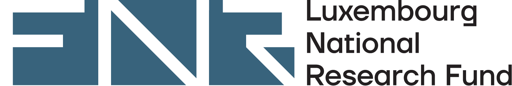

APM-ML is a collaborative project between the University of Luxembourg and the National University of Singapore. The two collaborating Professors are Prof. Bradley Ladewig and Prof. Dan Zhao. Mr Kris Helten is the PhD researcher working on the project and will spend a total of 12 months (across several placements) working in NUS Singapore developing advanced porous materials for hydrogen separations, supported by machine learning techniques.

*Funding Acknowledgement*

APM-ML is supported by the [Luxembourg National Research Fund](https://www.fnr.lu), Project 17112420, under the AFR Bilateral programme.

<!--more-->
