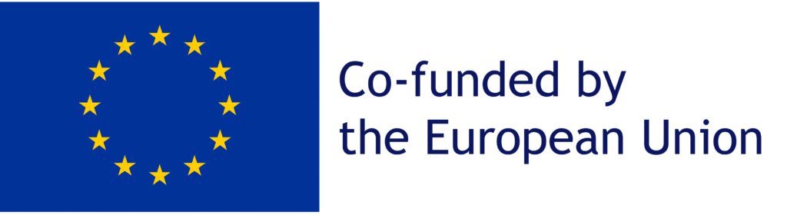

HyWay is a Marie Sklowdowska-Curie Staff Exchange project, coordinated by Prof. Bradley Ladewig. More details can be found on the dedicated [project website](https://hywayse.eu).

*Funding Acknowledgement*

HyWay is co-funded by the European Union under the Marie Sklowdowska-Curie Staff Exchange programme, project number: 101130009.

<!--more-->
